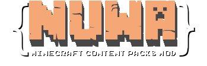

# Nuwa

50% Modding / 50% Resource Packs, 100% Content Packs

Create and implement your own ideas in Minecraft without writing a single line of code!

In Nuwa, everything is data-driven: write json files describing what you want, and Nuwa will take care of the details.

## Useful links
* [Wiki](https://nuwa.readthedocs.io/en/latest/)
* [Javadoc](https://files.leviathan-studio.com/amateis2/Nuwa/javadoc/)